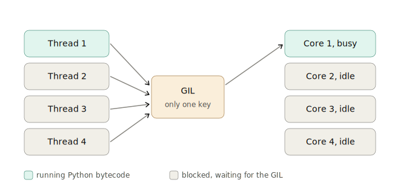

# Global Interpreter Lock (GIL)

`Apple` • `Google` • `Amazon` • `Meta` • `Microsoft`

## Question

What is the Global Interpreter Lock (GIL) in Python?

Follow-ups that usually come attached:

- Why does Python have a GIL in the first place?
- If Python has a GIL, why does the `threading` module exist at all?
- Does the GIL make Python thread-safe?
- How do you get true parallelism in Python?
- Is the GIL being removed?

<br><br>

## Answer

### 1. Three words you need first

- **Process**: one running program, with its own memory space.
- **Thread**: a worker inside that process. Multiple threads share the same memory.
- **Core**: a physical CPU unit that can actually execute instructions. An 8 core laptop can genuinely run 8 things in the same instant.

In most languages, starting 4 threads on a 4 core machine means the OS spreads them across the cores and you get real speedup.

**In Python this does not happen**, and the GIL is the reason.

### 2. What the GIL actually is

The Global Interpreter Lock is a single lock (a mutex) inside **CPython**, the standard Python interpreter.

The rule it enforces is one sentence:

<mark>Only one thread can execute Python bytecode at a time, no matter how many threads you create or how many CPU cores you have.</mark>

- A thread must **hold the GIL** to run Python code.
- There is exactly **one GIL per process**.
- So your 4 threads do not run at the same time. They take turns passing one key around.

**Mental model**: a meeting room with 8 chairs but only **one microphone**. Eight people are present, but only whoever holds the mic may speak. Everyone else sits and waits. Buying more chairs (more cores) does not let more people speak.



Three of your four cores do nothing, and you paid for all four.

### 3. Why does it exist at all?

It is not laziness. It is a deliberate tradeoff from the early 1990s.

**a) Reference counting**

Every Python object carries a counter of how many names point to it. When the count reaches zero, the object is freed.

```python
a = [1, 2, 3]   # refcount = 1
b = a           # refcount = 2
del b           # refcount = 1
```

That counter is updated constantly. If two threads changed the same counter at the same moment:

- Count goes too **low**: the object is freed while still in use, which means a crash.
- Count goes too **high**: the object is never freed, which means a memory leak.

One global lock makes all of this safe, cheaply.

**b) C extension safety**

Thousands of C libraries (image processing, database drivers, older numeric code) were written assuming "only one thread runs at a time". The GIL keeps that promise for them.

**c) Single threaded speed**

One coarse lock is far cheaper than putting a tiny lock on every single object. Fine grained locking would slow down the common case, which is ordinary single threaded code.

So the GIL buys **simplicity and safety**, and pays for it with **no multi core parallelism for Python code**.

### 4. When is the GIL released?

This is the part people miss, and it is the key to the whole answer.

A thread gives up the GIL in three situations:

- **On I/O**: network calls, file reads, database queries, `time.sleep()`. Before it starts waiting, the thread drops the GIL so another thread can run. This is exactly why threads are still useful in Python.
- **Every 5 milliseconds or so**: the interpreter forces a switch so that one CPU heavy thread cannot hog the lock forever. Tunable through `sys.setswitchinterval()`.
- **Inside C extensions**: NumPy, Pandas, PyTorch and similar libraries release the GIL while crunching numbers in C, so that work genuinely runs in parallel.

<mark>The GIL only blocks the execution of Python bytecode. Anything that is waiting, or running inside C, does not hold it.</mark>

### 5. What this means in practice

**CPU bound work with threads: no speedup, often slower**

```python
import threading, time

def count():
    x = 0
    for _ in range(50_000_000):
        x += 1

start = time.time()
t1 = threading.Thread(target=count)
t2 = threading.Thread(target=count)
t1.start(); t2.start()
t1.join(); t2.join()
print(time.time() - start)

# About the same as running count() twice in a row, sometimes worse,
# because the threads also pay the cost of fighting over the GIL.
```

**The same work with processes: real speedup**

```python
from multiprocessing import Process

# Each process gets its own interpreter and its own GIL,
# so 2 processes really do use 2 cores.
p1 = Process(target=count)
p2 = Process(target=count)
p1.start(); p2.start()
p1.join(); p2.join()

# Roughly half the time on a multi core machine.
```

**I/O bound work with threads: works beautifully**

```python
import threading, requests

# Each thread drops the GIL while waiting for the network,
# so 50 threads can have 50 requests in flight at once.
# The bottleneck here is the network, not the GIL.
```

### 6. Choosing the right tool

| Workload | Right tool | Why |
|-|-|-|
| CPU bound (math, image processing, compression) | `multiprocessing`, or C libraries like NumPy | Each process has its own GIL, so cores are actually used |
| I/O bound with a moderate number of tasks | `threading` | The GIL is released during every wait |
| I/O bound with thousands of tasks | `asyncio` | Same benefit as threads, but far cheaper per task |
| Mixed | `asyncio` for the I/O, a process pool for the CPU chunks | Keeps the event loop free |

### 7. How to work around the GIL

- **`multiprocessing`**: separate processes, separate GILs, true parallelism. Cost is memory, plus pickling data between processes.
- **C extensions**: NumPy, Pandas, PyTorch release the GIL for heavy loops. Vectorise instead of looping in Python.
- **`asyncio`**: does not fight the GIL, it simply makes waiting cheap. Great for I/O, useless for CPU work.
- **Other interpreters**: Jython and IronPython have no GIL. PyPy still has one.
- **Subinterpreters** (PEP 734, the `concurrent.interpreters` module): multiple interpreters in one process, each with its own GIL.

### 8. The GIL is actually being removed

Worth knowing, because interviewers now ask about it.

- **PEP 703** designed a **free threaded** CPython that replaces the GIL with per object locks and atomic reference counting.
- **Python 3.13** (October 2024): shipped as an **experimental** build.
- **Python 3.14** (October 2025): promoted to **officially supported but still optional**, through PEP 779. It ships as a separate binary, `python3.14t`.

The catches:

- Single threaded code runs roughly 5 to 10 percent slower in that build.
- If you import a C extension that has not declared itself thread safe, the interpreter quietly switches the GIL back on for the whole process.
- Making it the default is still several releases away.

So the correct framing today: <mark>the GIL is optional, not gone.</mark>

### 9. Common myths to correct

- **"The GIL makes Python thread safe."** No. It protects the interpreter's internals, not *your* data. Two threads doing `counter += 1` can still corrupt your counter, because that line is several bytecode operations and a switch can happen between them. You still need `threading.Lock`.
- **"Threads are useless in Python."** False. They are useless for CPU bound work, and very useful for I/O bound work.
- **"The GIL is part of the Python language."** No. It is an implementation detail of **CPython**. The language specification says nothing about it.

### 10. How to answer this in the interview (about 30 seconds)

The GIL is a mutex in CPython that allows only one thread to execute Python bytecode at a time, so a multithreaded Python program cannot use multiple cores for pure Python work. It exists because CPython's memory management relies on reference counting, which is not thread safe, and one global lock protects it cheaply while keeping C extensions simple. The practical consequence is that threads give no speedup for CPU bound work, but they still help a lot for I/O bound work, because the GIL is released during I/O waits and inside C extensions. For real CPU parallelism you use multiprocessing, C libraries like NumPy, or the free threaded build that became officially supported in Python 3.14.
