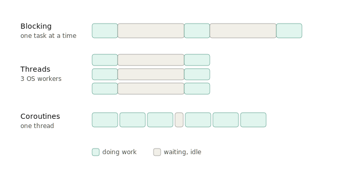

# Coroutines vs Threads

`Google` • `Uber` • `Amazon` • `Microsoft` • `Flipkart` • `Swiggy`

## Question

What are coroutines, and how do they differ from threads?

Follow-ups that usually come attached:

- Why are coroutines called "lightweight threads"?
- Can coroutines run in parallel on multiple CPU cores?
- What happens if a coroutine never suspends?
- When would you still pick threads over coroutines?

<br><br>

## Answer

### 1. Start with the problem both of them solve

A program normally runs one line at a time, top to bottom. That is fine until it has to **wait** for something:

- Waiting for a website to reply (network call)
- Waiting for a file to load from disk
- Waiting for a database query
- Waiting for a `sleep(3)`

During that wait, the CPU is doing nothing at all. It is a chef standing still, staring at a pot of boiling pasta.

So the real question that every concurrency tool tries to answer is:

<mark>While one task is waiting, can we do something else useful?</mark>

There are two classic answers:

- **Threads**: hire more chefs.
- **Coroutines**: teach one chef to stop staring at the pot.

### 2. What is a thread

A thread is a worker created and managed by the **operating system**.

- Your program says "OS, please run this function as a separate worker".
- The OS gives that worker its own stack (its own scratch space, typically around 1 MB).
- The OS decides when each thread runs and when it gets paused. Your program has no say in it.

That last point has a name: **preemptive multitasking**. The OS can freeze your thread at *any* instruction, even in the middle of `x = x + 1`, and switch to another thread.

**What threads give you**

- True parallelism. Threads are the only way to actually use multiple CPU cores at the same time (real chefs cooking simultaneously).

**What threads cost you**

- **Memory**: roughly 1 MB each, so 10,000 threads means around 10 GB. Not happening.
- **Switching cost**: swapping threads goes through the kernel, which is relatively slow.
- **Race conditions**: since a thread can be paused mid-operation, two threads touching the same variable can corrupt it. That is why locks, mutexes, deadlocks, and the general misery of multithreaded debugging exist.

### 3. What is a coroutine

A coroutine is a **function that can pause itself and be resumed later**.

- **Normal function**: you call it, it runs to the end, it returns. Once.
- **Coroutine**: you call it, it runs, hits a point where it is about to wait, **saves its place and hands control back**. Later it picks up exactly where it left off, with all its local variables intact.

The keywords in async code make this visible:

- `await something` means "I am going to be waiting here, someone else can run in the meantime".
- The scheduler (an **event loop** living inside your program, not inside the OS) then picks the next coroutine that is ready and runs it.

This is called **cooperative multitasking**: coroutines give up control voluntarily, at points that *you* wrote in the code. Nobody freezes them mid-statement.

Coroutines are cheap because there is no OS worker behind them. A coroutine is just a small object holding "where I paused and what my variables were", often only a few KB. Running a million of them on a single thread is normal.

### 4. Seeing the difference on a timeline

Same span of time, three different models. `W` is doing work, `.` is sitting idle and waiting.



The coroutine row is the whole idea: the waiting gaps of one task get filled with the work of another task, without creating a single extra OS worker.

### 5. Core differences at a glance

| Aspect | Threads | Coroutines |
|-|-|-|
| Managed by | Operating system | Your program's runtime (event loop) |
| Switching style | Preemptive (OS interrupts you anywhere) | Cooperative (you yield at `await`) |
| Cost of each | About 1 MB, thousands maximum | A few KB, millions possible |
| Switch speed | Slow (kernel is involved) | Fast (basically a function call in user space) |
| True parallelism | Yes, uses multiple cores | No, typically one thread (unless the runtime spreads them) |
| Race conditions | Everywhere, locks required | Rare, since pause points are known |
| Where pauses happen | Anywhere, invisible in the code | Only at `await` or `yield`, visible in the code |

<mark>One sentence to remember: threads are scheduled by the OS and can be interrupted anywhere, while coroutines schedule themselves and only pause where you told them to.</mark>

### 6. Seeing it in code

**Threads**

```python
import threading, time

def fetch(n):
    time.sleep(2)        # blocks THIS thread, the OS parks it
    print("done", n)

for i in range(3):
    threading.Thread(target=fetch, args=(i,)).start()

# 3 OS threads, about 2 seconds total
```

**Coroutines**

```python
import asyncio

async def fetch(n):
    await asyncio.sleep(2)   # pauses THIS coroutine, frees the thread
    print("done", n)

async def main():
    await asyncio.gather(fetch(0), fetch(1), fetch(2))

asyncio.run(main())

# 1 thread, about 2 seconds total, and this scales to 100,000 tasks
```

Same result for 3 tasks. The difference shows up at scale: the second version can handle 100,000 concurrent waits without the machine falling over.

### 7. The catch with coroutines

Because a coroutine only pauses where you say, a coroutine that never yields **blocks everyone else on that thread**.

```python
async def bad():
    time.sleep(5)          # blocking sleep, freezes the entire event loop

async def good():
    await asyncio.sleep(5) # yields control, other coroutines keep running
```

This is the number one practical mistake and interviewers love it. One badly written coroutine (a blocking call, or heavy CPU math) stalls every other coroutine on that thread, because nobody is allowed to preempt it.

### 8. When to use which

- **I/O bound work** (network calls, DB queries, API servers, web scraping, chat apps): use **coroutines**. You are mostly waiting, so filling the gaps is the entire game.
- **CPU bound work** (image processing, number crunching, compression): use **threads or processes**. There are no waiting gaps to fill, you need real extra cores. In Python specifically, prefer processes, because the GIL stops threads from running Python bytecode in parallel anyway.
- **Mixed workloads**: coroutines for the I/O, and offload the heavy CPU chunks to a thread pool or process pool.

### 9. Two things people commonly mix up

**Concurrency vs parallelism**

- Concurrency is *dealing with* many things at once (one chef juggling dishes).
- Parallelism is *doing* many things at once (many chefs).
- Coroutines give you concurrency. Threads can give you both.

**"Coroutines are just lightweight threads" is not true everywhere**

- In **Go**, goroutines sit between the two. They look like coroutines to you, but the runtime multiplexes them across real OS threads, so they get parallelism too.
- In **Python**, asyncio coroutines stay on a single thread and give concurrency only.

### 10. How to answer this in the interview (about 30 seconds)

Both let you handle many tasks at once. A thread is an OS managed worker that the OS can preempt at any moment, costs roughly a megabyte, and can run on a separate core. A coroutine is a function that suspends itself at explicit `await` points, is scheduled by a user space event loop, costs a few kilobytes, and usually shares one thread. So threads suit CPU bound work that needs real parallelism, while coroutines suit I/O bound work where you want tens of thousands of concurrent waits cheaply. The tradeoff is that threads risk race conditions from unpredictable preemption, while coroutines risk one blocking call freezing the whole event loop.
