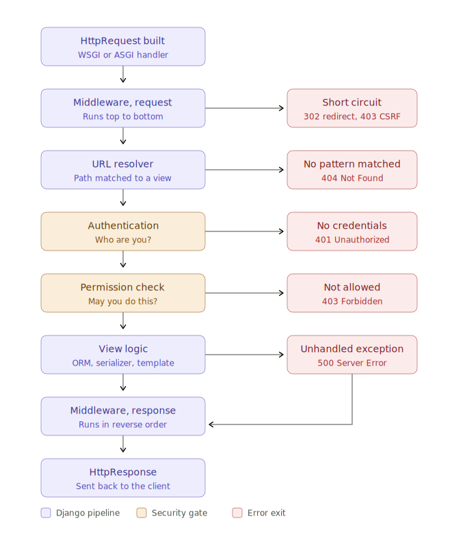

# Django Request to Response Flow (Including Permission Checks)

`Accenture` • `TCS` • `Infosys` • `Cognizant` • `Wipro` • `Capgemini` • `Zoho`

## Question

Describe the complete flow from request to response in Django.

- Where does middleware fit in?
- Where exactly does the permission check happen?
- What changes when the request fails?

<br><br>

## Answer

### 1. The Whole Flow in One Picture



<mark>Read this top to bottom for the success path, and read every side arrow as an early exit. That is the entire lifecycle in one glance.</mark>

<br><br>

### 2. The Success Path, Stage by Stage

**Step 1: Server hands off to Django**

- Nginx receives the raw HTTP request and passes it to a WSGI or ASGI server (Gunicorn, uWSGI, Daphne).
- That server calls Django's `WSGIHandler`, which builds an `HttpRequest` object.
- From this point on, everything is Django.

**Step 2: Middleware, on the way in**

- Django walks the `MIDDLEWARE` list in `settings.py` from **top to bottom**.
- Each middleware can pass the request along, or stop it dead by returning a response.
- The usual suspects:
  - `SecurityMiddleware` (HTTPS redirects, security headers)
  - `SessionMiddleware` (loads the session cookie into `request.session`)
  - `AuthenticationMiddleware` (attaches `request.user`)
  - `CsrfViewMiddleware` (validates the CSRF token on POST, PUT, DELETE)

<mark>AuthenticationMiddleware only ATTACHES the user. It never authorizes anything. Authentication and authorization are two separate stages.</mark>

**Step 3: URL resolution**

- Django takes `request.path_info` and matches it against `urlpatterns`, starting from `ROOT_URLCONF`.
- On a match it produces a `ResolverMatch`: the view callable plus its args and kwargs.
- No match means a `404`.

**Step 4: View middleware (optional hook)**

- Any middleware with a `process_view()` hook runs now.
- This is after the view has been identified but **before** it is called, so it is the last chance to intercept.

**Step 5: The view runs (and this is where permissions live)**

- Authentication resolves `request.user`.
- Permissions decide whether that user is allowed through.
- Only then does your actual code run: ORM queries, serializers, template rendering.

**Step 6: The response travels back out**

- Middleware now runs **bottom to top**, the exact reverse of Step 2.
- Session cookies get written, gzip compresses, CORS headers get attached.
- The finished `HttpResponse` goes back through WSGI to the server, and out to the client.

<br><br>

### 3. The Two Gates (The Part People Confuse)

These are two different questions asked at two different moments.

| | Authentication | Permission |
|---|---|---|
| Asks | Who are you? | May you do this? |
| Sets | `request.user` | Nothing, it only decides |
| Fails with | `401 Unauthorized` | `403 Forbidden` |
| Meaning of failure | I do not know who you are | I know exactly who you are, and the answer is still no |

<mark>Authentication never rejects you for lack of privilege. It only decides whether you are a real User or an AnonymousUser. Permission is the stage that actually says no.</mark>

<br><br>

### 4. Where the Permission Check Actually Runs

**In plain Django**, permissions are decorators or mixins on the view.

```python
from django.contrib.auth.decorators import login_required, permission_required

@login_required                        # Is anyone logged in at all?
@permission_required('blog.add_post')  # Do they hold this specific permission?
def create_post(request):
    ...
```

- Under the hood this is `request.user.has_perm('blog.add_post')`.
- That call checks the user's direct permissions **plus** every permission inherited from their groups.
- Failing `login_required` redirects to the login page.
- Failing `permission_required` raises `PermissionDenied`, which Django converts into a `403`.

**In Django REST Framework**, permissions run inside `APIView.dispatch()`, which calls `initial()`.

```python
def initial(self, request, *args, **kwargs):
    self.perform_authentication(request)  # 1. Resolve request.user
    self.check_permissions(request)       # 2. Run permission_classes
    self.check_throttles(request)         # 3. Enforce rate limits
```

- **Authentication:** loops through `authentication_classes` (Session, Token, JWT). The first one that succeeds sets `request.user` and `request.auth`. If none succeed, the user is `AnonymousUser`.
- **Permissions:** loops through `permission_classes` and calls `has_permission(request, view)` on each one.

<mark>Every permission class must return True. It is an AND, not an OR. A single False raises PermissionDenied.</mark>

- **Object level permissions:** these run later, when the view calls `get_object()`. That triggers `check_object_permissions()`, which runs `has_object_permission(request, view, obj)`. This is the hook for rules like "you may only edit **your own** post".

<br><br>

### 5. The Error Paths

Each stage can only fail in its own way, which is why the status codes line up so cleanly with the pipeline.

| Stage that fails | What went wrong | Response |
|---|---|---|
| Middleware (request) | CSRF token invalid, or not logged in and redirected | `302` or `403` |
| URL resolver | No `urlpatterns` entry matched the path | `404` |
| Authentication | Credentials missing or invalid | `401` |
| Permission check | Valid user, but not authorised for this action | `403` |
| View logic | Something crashed in the ORM, serializer, or your code | `500` |

**Exception handling:**

- In plain Django, a raised exception walks the `process_exception` hooks from the bottom up. Anything unhandled becomes a `500`.
- In DRF, exceptions instead go through its own `exception_handler`, which turns `PermissionDenied`, `NotAuthenticated`, and `ValidationError` into clean JSON error responses.

<br><br>

### 6. The Onion (The Detail Most People Miss)

<mark>An error response is still a response. It does not escape the pipeline, it rejoins it.</mark>

- A `403` from a permission check is **not** thrown straight at the browser.
- It travels back up through the **response middleware in reverse order**, exactly like a `200` would.
- Session cookies are still written. Gzip still compresses. CORS headers are still attached.

This is the onion model:

- Whatever middleware wraps the request **first** on the way in
- is the one that unwraps the response **last** on the way out.

<br><br>

### 7. Quick Recap

Say this line in an interview and you have covered the whole thing:

> Server → WSGI → middleware (in, top to bottom) → URL resolver → **authenticate → authorize → throttle** → view logic → ORM and serializer → middleware (out, reversed) → response.

Three things worth stating out loud:

- Middleware is an **onion**, not a queue. In goes top to bottom, out goes bottom to top.
- **Authentication is not authorization.** One sets `request.user`, the other judges it.
- **Every response, including errors, exits through the response middleware.**

<br><br>

## Related Questions

- What is middleware in Django, and how do you write a custom one?
- Why does response middleware run in reverse order?
- What is the difference between WSGI and ASGI?
- What is the difference between `401` and `403`?
- How do `authentication_classes` and `permission_classes` differ in DRF?
- What is the difference between `has_permission` and `has_object_permission`?
- How does `request.user.has_perm()` resolve group permissions?
- How does `CsrfViewMiddleware` protect a POST request?
- What is the difference between Django's MVT and the classic MVC pattern?